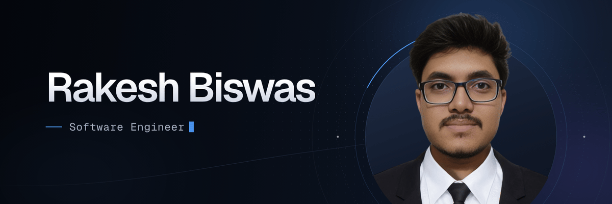

  

  <picture>
    <source media="(prefers-color-scheme: dark)" srcset="https://readme-typing-svg.demolab.com?font=Fira+Code&weight=500&size=20&duration=3500&pause=2000&color=3D7FFF&center=true&vCenter=true&width=520&height=40&lines=Hi+there%2C+I%27m+Rakesh+Biswas;Software+Engineer+%7C+Full+Stack+Developer" />
    
  </picture>

  <b>Software Engineer at GoDevs</b> · Full Stack · TypeScript, React, Next.js, Node.js 
  Khulna, Bangladesh · Open to software engineering opportunities

  &nbsp;
  &nbsp;
  

## About

I'm a full stack software engineer who builds web applications end to end: typed React/Next.js frontends, REST APIs, and the data layer behind them. My work centres on role-based dashboards, authentication, payments and data-heavy interfaces, with attention to clear structure, validation at the boundaries, and documentation that lets someone else run the project.

- **Currently:** Software Engineer at **GoDevs**
- **Core stack:** TypeScript · React · Next.js · Node.js · Express · MongoDB · PostgreSQL
- **Engineering interests:** API and data-model design, access control, algorithms and data structures
- **Beyond product work:** competitive programming in C++ (400+ problems solved) and applied research in simulation and machine learning

### How to Reach Me

<table>
  <tr><td><b>Professional</b></td><td><a href="mailto:rbiswas01999@gmail.com">&nbsp;rbiswas01999@gmail.com</a>&ensp; <a href="https://www.linkedin.com/in/rakeshbiswas0199/">&nbsp;LinkedIn</a>&ensp; <a href="https://github.com/Rakesh01999">&nbsp;GitHub</a>&ensp; <a href="https://rakesh-biswas-portfolio-nextjs.vercel.app/">&nbsp;Portfolio</a></td></tr>
  <tr><td><b>Direct</b></td><td><a href="https://wa.me/8801999647103">&nbsp;WhatsApp</a>&ensp; <a href="https://t.me/Rakesh01999">&nbsp;Telegram</a>&ensp; &nbsp;+880 1999-647103</td></tr>
  <tr><td><b>Social</b></td><td><a href="https://www.facebook.com/rakeshbiswas.biswas.9843/">&nbsp;Facebook</a></td></tr>
</table>

## Technical Skills

<table>
  <tr>
    <td><b>Languages</b></td>
    <td>&nbsp;JavaScript&ensp; &nbsp;TypeScript&ensp; &nbsp;C&ensp; &nbsp;C++&ensp; &nbsp;Python&ensp; &nbsp;SQL</td>
  </tr>
  <tr>
    <td><b>Frontend</b></td>
    <td>&nbsp;React&ensp; &nbsp;Next.js&ensp; &nbsp;Redux&ensp; &nbsp;Tailwind CSS&ensp; &nbsp;HTML5&ensp; &nbsp;CSS&ensp; &nbsp;shadcn/ui&ensp; &nbsp;Ant Design&ensp; &nbsp;PrimeReact&ensp; &nbsp;TanStack Query&ensp; Zustand</td>
  </tr>
  <tr>
    <td><b>Backend</b></td>
    <td>&nbsp;Node.js&ensp; &nbsp;Express&ensp; &nbsp;GraphQL&ensp; &nbsp;REST APIs&ensp; &nbsp;JWT&ensp; &nbsp;Zod&ensp; &nbsp;Axios&ensp; bcrypt</td>
  </tr>
  <tr>
    <td><b>Database & ORM</b></td>
    <td>&nbsp;MongoDB&ensp; &nbsp;Mongoose&ensp; &nbsp;PostgreSQL&ensp; &nbsp;Prisma&ensp; &nbsp;Firebase</td>
  </tr>
  <tr>
    <td><b>Cloud / DevOps</b></td>
    <td>&nbsp;Docker&ensp; &nbsp;AWS&ensp; &nbsp;Nginx&ensp; &nbsp;Vercel&ensp; &nbsp;Netlify&ensp; &nbsp;Firebase Hosting</td>
  </tr>
  <tr>
    <td><b>Testing & Tools</b></td>
    <td>&nbsp;Jest&ensp; &nbsp;Vitest&ensp; &nbsp;ESLint&ensp; &nbsp;Prettier&ensp; &nbsp;Git&ensp; &nbsp;GitHub&ensp; &nbsp;Postman</td>
  </tr>
</table>

## Featured Projects

### SmartCollab — Project & Task Collaboration
Team workspace for coordinating projects, assigning tasks and tracing activity. Role-based access control (Admin / Project Manager / Team Member), Kanban status flow, search, filtering and sorting, task comments and attachments, bulk actions, and an analytics dashboard with a live activity log.
**Stack:** Next.js (App Router) · Redux Toolkit · Tailwind CSS · Node.js · Express · MongoDB
[Repository](https://github.com/Rakesh01999/SmartCollab) · [Live demo](https://smartcollab-sc.vercel.app/) · [API](https://smart-collab-backend.vercel.app/)

### VerbaSense — Speech-to-Text Application
Voice transcription app built on the whisper.cpp engine, with FFmpeg audio normalisation, JWT-secured accounts and transcription history management.
**Stack:** Next.js · Tailwind CSS · shadcn/ui · Framer Motion · Node.js · Express · MongoDB · whisper.cpp
[Repository](https://github.com/Rakesh01999/VerbaSense) · [Live demo](https://verbasense.vercel.app)

### BasaFinder — Rental Housing Marketplace
Connects landlords, tenants and admins: listings with search and filters, rental requests with approve/reject, payments, and separate role-based dashboards.
**Stack:** Next.js · TypeScript · Redux Toolkit · shadcn/ui · Node.js · Express · MongoDB · JWT · bcrypt
[Client](https://github.com/Rakesh01999/BasaFinder-client) · [Server](https://github.com/Rakesh01999/basa-finder-server) · [Live demo](https://basa-finder-next.vercel.app/)

### AutoVerse — Bike Shop
Full stack MERN store for browsing, purchasing and managing bikes, with JWT authentication and Shurjopay payment integration.
**Stack:** React · TypeScript · Redux Toolkit · Tailwind CSS · Ant Design · Node.js · Express · MongoDB · Mongoose
[Client](https://github.com/Rakesh01999/bike-shop-client) · [Server](https://github.com/Rakesh01999/bike-shop-server) · [Live demo](https://bike-shop-client-ruby.vercel.app/)

## Problem Solving & Research

- **Competitive programming:** 400+ problems solved across Codeforces, CodeChef, AtCoder, LightOJ and LeetCode (C++) — [Codeforces](https://github.com/Rakesh01999/codeforces) · [CodeChef](https://github.com/Rakesh01999/codechef) solutions
- **Data science:** Participant, Datathon at KUET CSE Bit Fest 2025 — [repository](https://github.com/Rakesh01999/Game-of-Datathon-Bitfest-2025)
- **Research:** Simulation-based EV charging load prediction for Khulna City using SUMO/TraCI, Python and ML (XGBoost, Random Forest) — [repository](https://github.com/Rakesh01999/Research-Work-BPV)

## GitHub Activity

  
  

  

  

---

<h3 align="center">Connect with me</h3>

  &emsp;
  &emsp;
  

  <i>"The only way to do great work is to love what you do."</i> — Steve Jobs

  

